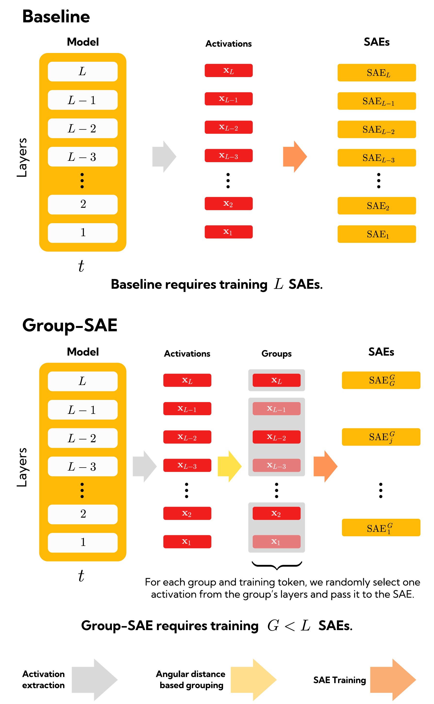

# Group-SAE: Efficient Training of Sparse Autoencoders for Large Language Models via Layer Groups

<p align="center">
  <object data="imgs/paper_img.png" type="application/png" width="75%" style="max-width:720px;">
    
  </object>
</p>

Sparse autoencoders (SAEs) are a powerful tool for interpreting the latent computations of large language models, but training an SAE per layer is expensive. **Group-SAE** clusters similar transformer blocks and trains a *single* SAE over each cluster, preserving reconstruction quality while cutting training cost. This repository hosts the official implementation for the EMNLP 2025 paper *Efficient Training of Sparse Autoencoders for Large Language Models via Layer Groups* and the full pipeline used for the Pythia 160M/410M/1B models.

## TL;DR
- Layer-wise SAEs are replaced by **clustered SAEs** trained jointly on groups of contiguous transformer blocks.
- **AMAD (Average Maximum Angular Distance)** selects the number of clusters by balancing reconstruction fidelity against wall-clock cost.
- The repo ships with **pre-computed layer assignments, trained checkpoints, evaluation artefacts, feature caches,** and interpretability tooling.
- Supports **baseline (per-layer) and clustered training**, distributed runs, reconstruction/faithfulness benchmarks, feature-level analyses, and GPT-assisted interpretation.

## Quickstart

### 1. Environment
Requirements: Python 3.10+, CUDA-ready PyTorch installation, and access to the Hugging Face Hub.

```bash
python -m venv .venv
source .venv/bin/activate
pip install --upgrade pip
pip install -e .
```

Optional additions:
- `pip install bitsandbytes` to enable the 8-bit Adam optimizer path (`TrainConfig.adam_8bit`).
- `pip install uv` and `uv pip sync uv.lock` if you prefer uv-managed environments.
- `pip install pytest ruff black` for the lightweight developer tooling defined in `pyproject.toml`.

> The training scripts stream from `NeelNanda/pile-small-tokenized-2b`. Export `HF_TOKEN` if you need gated access. GPU VRAM requirements scale roughly with model width × cluster size.

### 2. Download released checkpoints & assets
We host clustered/baseline SAEs on Hugging Face. The helper script pulls everything (git-lfs required):

```bash
bash scripts/download.sh         # downloads baseline + clustered SAEs into ./saes
bash scripts/download_features.sh # optional: grabs cached latents for interpretation
```

Layer-group JSON files for each model live in `group_sae/groups/` and mirror the configurations used in the paper.

### 3. Train your own SAEs
Baseline (single layer) training entrypoint (`training/train_topk.py`):

```bash
python training/train_topk.py \
  --model EleutherAI/pythia-160m-deduped \
  --batch_size 16 \
  --num_training_tokens 1_000_000_000
```

Clustered training (`training/train_cluster_topk.py`) accepts the same hyperparameters plus automatic loading of AMAD-derived clusters. Use `torchrun` for multi-GPU:

```bash
torchrun --nproc-per-node=8 training/train_cluster_topk.py \
  --model_name pythia-410m \
  --batch 8           # sequences/GPU
```

Under the hood:
- `group_sae.config.TrainConfig` / `SaeConfig` capture all training knobs (k-sparsity, JumpReLU, aux losses, schedulers, logging).
- `group_sae.trainer.SaeTrainer` handles per-layer SAEs, gradient accumulation, activation normalization, FVU/L2 losses, dead feature pruning, resume logic, and (optional) distributed parameter sharding.
- `group_sae.trainer_cluster.ClusterSaeTrainer` extends the trainer to shared weights across clustered hookpoints and ensures shape consistency within each cluster.

### 4. Evaluate & analyse
Once checkpoints are in `saes/<model>-topk/`, the provided scripts reproduce the paper’s tables:

| Script | What it does |
| --- | --- |
| `scripts/run_evals_recon.sh` | KL/CE reconstruction metrics via `recon/recon.py` using SAE Lens `EvalConfig` |
| `scripts/get_effects_pythia_*.sh` | Circuit efficiency & causal tracing benchmarks (`downstream/effects.py`) |
| `scripts/get_faith_pythia_*.sh` | Logit-diff faithfulness / completeness curves (`downstream/faith_topk.py`) |
| `scripts/feature_concordance.sh` | Feature overlap across cluster sizes (`feature_concordance/concordance.py`) |
| `scripts/feature_spreading.sh` | Token-level feature utilisation stats (`feature_spreading/feature_spreading.py`) |
| `scripts/mmcs.sh` | Mean Maximum Causal Score heatmaps (`mmcs/mmcs.py`) |
| `scripts/auto_interp.sh` | End-to-end activation caching + GPT explanations + grading (`interp/*.py`) |

Most pipelines expect cached features (see `scripts/cache_features.sh` or `feature_concordance/caching.py`) and will spill results to the sibling directories (`recon/`, `faithfulness/`, `feature_concordance/`, `feature_spreading/`, `mmcs/`, `interp/`).

## Repository Tour

```
├── group_sae/              # Core library (configs, trainers, SAE module, Triton kernels, utilities)
│   ├── config.py           # Dataclasses for TrainConfig / SaeConfig / RunConfig
│   ├── sae.py              # SAE module with JumpReLU, top-k support, disk & hub loaders
│   ├── trainer*.py         # Baseline + clustered trainers, DDP-aware
│   ├── distance.py         # Angular distance + (Approx) CKA metrics used for AMAD
│   ├── normalization.py    # Activation norm scaling estimation
│   ├── utils.py            # MODEL_MAP, loading helpers, lr / l1 schedulers, Triton decoder
│   └── groups/*.json       # Layer-cluster assignments for Pythia family (baseline + sequential)
├── training/               # CLI entrypoints & launch scripts for large-scale runs
├── recon/, downstream/, feature_* , faithfulness/, mmcs/, interp/  # Evaluation & analysis suites
├── scripts/                # Bash wrappers for reproducing experiments end-to-end
├── groups/                 # AMAD sweeps, sequential baselines, and artefacts bundled with the paper
├── eval*/                  # Cached evaluation CSVs from the paper (cluster vs. baseline)
├── imgs/                   # Figures referenced in README/paper
└── tests/                  # Smoke tests for cluster aggregation logic (`test_new_utils.py`)
```

You can import the packaged API directly:

```python
from group_sae import Sae, SaeConfig, SaeTrainer, ClusterSaeTrainer, TrainConfig
```

## Working with pretrained SAEs
Utilities in `group_sae.utils` smooth the hand-off between training outputs and downstream tooling:

- `load_saes` and `load_saes_by_training_clusters` convert saved checkpoints into [`sae_lens`](https://github.com/jbloomAus/SAELens) compatible modules, automatically folding in activation-norm scaling factors and matching cluster layouts.
- `to_sae_lens` (also re-exported in `export/to_sae_lens.py`) mirrors the conversion pipeline used in the released Hugging Face repos.
- `MODEL_MAP` records per-model metadata (layers, width, AMAD coefficients) consumed throughout the evaluation suite.
- `load_cluster_map`, `load_training_clusters`, and `chunk_almost_equal_sum` power the AMAD grouping logic and device-aware workload balancing.

Example: load cluster `K=5` SAEs for Pythia-410M and inspect reconstructions from cached activations:

```python
from transformer_lens import HookedTransformer
from group_sae.utils import load_saes

model = HookedTransformer.from_pretrained("pythia-410m", device="cuda")
tokenizer = model.tokenizer
saes = load_saes("saes/pythia_410m-topk", model_name="pythia-410m", cluster="5")

inputs = tokenizer("The Eiffel Tower is in Paris", return_tensors="pt").to(model.cfg.device)
with torch.no_grad():
    logits, cache = model.run_with_cache(**inputs)
    hook_name = "blocks.6.hook_resid_post"
    activations = cache[hook_name]              # (batch, tokens, d_model)
    sae = saes[hook_name].to(activations.device)
    features = sae.encode(activations)
    reconstruction = sae.decode(features)
```

## Evaluation & interpretability modules
- **Reconstruction (`recon/recon.py`)** – wraps SAE Lens `run_evals` with cluster-aware loading and exports CSVs summarising KL divergence, CE loss, sparsity, and variance metrics per layer/cluster.
- **Downstream causal analysis (`downstream/*.py`)** – implements IOI, subject-verb, and greater-than tasks using SAE-mediated patching hooks (`downstream/hooks.py`). Supports attribution (`effects.py`), faithfulness vs. sparsity thresholds (`faith_thr.py`), and logit-diff curves (`faith_topk.py`).
- **Feature concordance/spreading** – caches top-activating features, computes Jaccard overlaps across cluster sizes, and quantifies feature reuse ratios.
- **Interpretability tooling (`interp/`)** – caches activations, sends prompts to GPT (set `OPENAI_API_KEY`), scores explanations, and renders seaborn/matplotlib figures (`interp/analysis.py`).
- **Feature analysis (`feature_analysis/`)** – selects representative latent pairs, generates GPT explanations, and aggregates similarity JSON for camera-ready figures.
- **MMCS (`mmcs/mmcs.py`)** – computes Mean Maximum Causal Score matrices by comparing decoder columns between baseline and clustered SAEs.

Most scripts accept `--sae_root_folder`, `--model_name`, `--K`, and `--n_devices` arguments; consult each file for task-specific flags.

## Computing layer similarity & AMAD
The grouping heuristics originate from `group_sae/distance.py`:
- `AngularDistance` tracks the average angular separation between layer activations.
- `CKA` and `ApproxCKA` implement exact and approximate Centered Kernel Alignment.
`scripts/distances.sh` wraps these utilities to pre-compute similarity matrices before applying AMAD. Resulting JSON artefacts (per number of clusters `G`) are what populate `group_sae/groups/` and downstream evaluation folders.

## Development tips
- Run `pytest` to execute the sanity checks in `tests/`.
- `ruff check .`, `black .`, and `isort .` obey the formatting constraints defined in `pyproject.toml` (99-char lines, import sorting, etc.).
- Training supports DDP launches (`TrainConfig.distribute_modules`) and gradient/micro-batching (`grad_acc_steps`, `micro_acc_steps`). Watch for the `ClusterSaeTrainer` requirement that all modules in a cluster emit identically shaped activations.
- The Triton decoder (`group_sae/kernels.py`) accelerates top-k decoding; set `SAE_DISABLE_TRITON=1` to fall back to the eager implementation if Triton is unavailable.

## Citation
If you use this codebase or the released SAEs, please cite:

```
@inproceedings{
  ghilardi2025efficient,
  title={Efficient Training of Sparse Autoencoders for Large Language Models via Layer Groups},
  author={Davide Ghilardi and Federico Belotti and Marco Molinari and Tao Ma and Matteo Palmonari},
  booktitle={Proceedings of the 2025 Conference on Empirical Methods in Natural Language Processing},
  year={2025},
  url={https://openreview.net/forum?id=bk4PhF17cm}
}
```

## License & acknowledgements
Released under the MIT License (see `pyproject.toml`). Built on top of:
- [TransformerLens](https://github.com/neelnanda-io/TransformerLens)
- [sae-lens](https://github.com/jbloomAus/SAELens)
- [EleutherAI sparse autoencoder kernels](https://github.com/EleutherAI/sae)

We thank the interpretability community for open-sourcing tooling that made this project possible.
